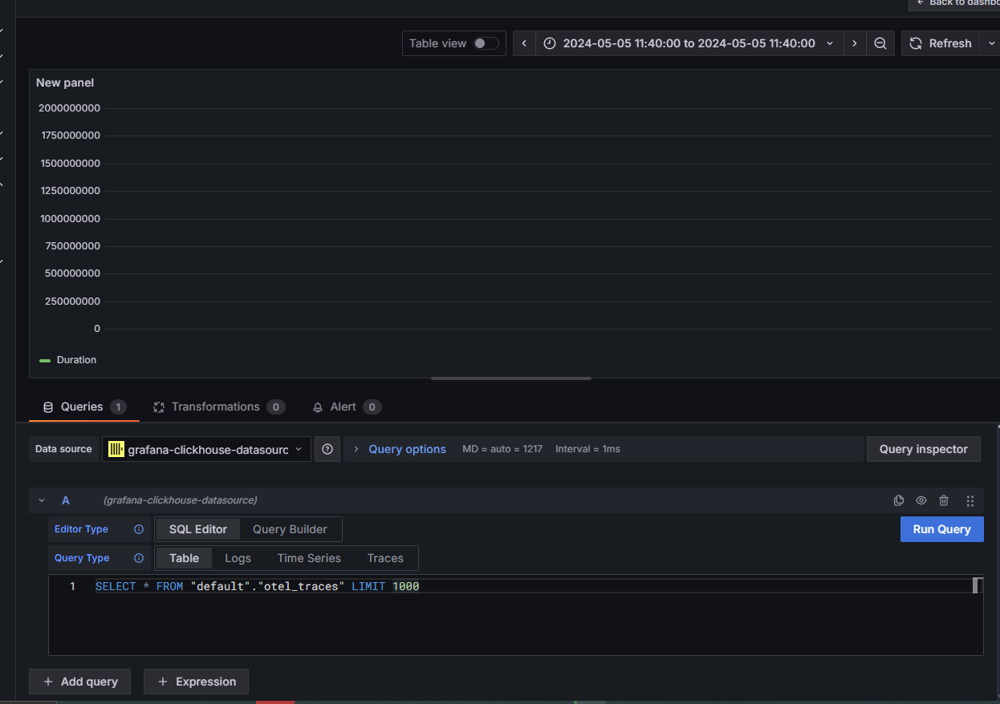

# CLICKHOUSE-OPENTELEMETRY POC

1 -> Run docker compose
```sh
docker-compose up
```

2 -> Run the curl below to send traces to OTEL collector
```
curl --location 'http://localhost:4318/v1/traces' \
--header 'Content-Type: application/json' \
--data '{
    "resourceSpans": [
      {
        "resource": {
          "attributes": [
            {
              "key": "service.name",
              "value": { "stringValue": "curl-tracer" }
            }
          ]
        },
        "instrumentationLibrarySpans": [
          {
            "instrumentationLibrary": {
              "name": "manual-curl",
              "version": "1.0.0"
            },
            "spans": [
              {
                "traceId": "4fd0b6133d7f42a1a00a7d3c1e5f50fc",
                "spanId": "5c1e5f50fca00a7d",
                "name": "curl-span",
                "kind": "SPAN_KIND_INTERNAL",
                "startTimeUnixNano": 1690000000000000000,
                "endTimeUnixNano": 1690000001000000000,
                "attributes": [
                  {
                    "key": "http.method",
                    "value": { "stringValue": "GET" }
                  }
                ]
              }
            ]
          }
        ]
      }
    ]
  }'
```

3 -> Enter on Grafana and configure clickhouse as a datasource


4 -> You will see something like this:
